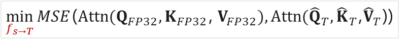
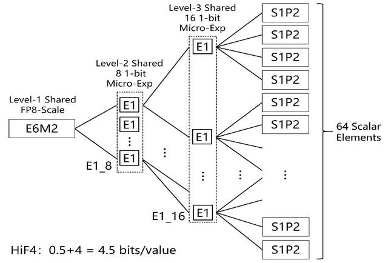
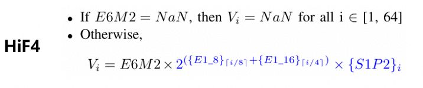
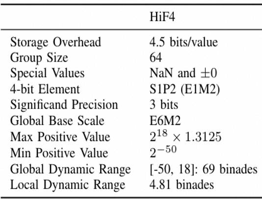
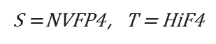

# 2026 Huawei Algorithm Competition — Preliminary Round

# High-Precision 4-Bit Numerical Conversion Algorithm — Task Document

**2026 Huawei Algorithm Competition Organizing Committee** · 2026-07-15

**Table of Contents**

# Background Information
High-Precision 4-Bit Numerical Background
With the release and widespread adoption of large models such as ChatGPT and GPT-4, Large Language Models (LLMs) have become a major focus of attention in the industry. However, the high deployment costs associated with LLM inference can significantly hinder their widespread adoption.
Quantization is a key technology for accelerating LLM inference in the industry. In short-context scenarios (e.g., sequence lengths below 2K tokens), LLM inference is typically memory-bound, with weight movement overhead becoming the primary performance bottleneck. Applying weight quantization or weight-activation quantization to Linear layers can effectively improve inference efficiency. For long-context scenarios, the memory consumption of KV cache and the overall computational workload increase dramatically. Therefore, quantization of both Linear layers and KV cache is required to accelerate inference and alleviate computational and memory bottlenecks..
In recent years, low-precision computing has become a key approach to improving training efficiency and reducing memory consumption. The evolution from FP16 to FP8 and FP4 demonstrates a clear trend, with 4-bit precision becoming a critical choice for next-generation LLM training and inference. Since different computing hardware vendors define 4-bit numerical formats differently, format conversion from various 4-bit representations to Ascend HiF4 is required. This will improve Ascend’s future compatibility with the 4-bit inference ecosystem and better support 4-bit model deployment, meeting customer requirements for 4-bit inference on Ascend platforms or in hybrid Ascend-GPU environments..
Definition of High-Precision 4-Bit Numerical Conversion Algorithm
Given matrix multiplication inputs A and B (format S), converted to format T via the 4-bit conversion algorithm f_(S→T), both de-quantized to FP32 before performing matrix multiplication. The requirement is that the MSE of the MatMul result before and after conversion is sufficiently small：

Given Q, K, V in Attention computation (format S), converted to format T via the 4-bit conversion algorithm f_(S→T), all de-quantized to FP32 before performing Attention. The requirement is that the MSE of the Attention result before and after conversion is sufficiently small：

Where
$XFP32=DequantFP32(XS)$
$XT=DequantFP32fS→TXT$
*S**NVFP4**，**T = HiF4* $=$
High-Precision 4-Bit Numerical Formats

 Fig 1  HIF4 Block Format Structure

Fig 2  Calculation method for HiF4

Fig 3   Introduction to Typical Values and Characteristics of HiF4
High-Precision 4-Bit Numerical Conversion Algorithm Challenges
Scale Hierarchy Mismatch: Different 4-bit data formats have different quantization scale hierarchies. Other 4-bit quantization scales cannot be directly mapped to HiF4's three-level hierarchy (E6M2 + E1_8 + E1_16), requiring a complete reconstruction of the statistical domain and scaling logic.
Value Set Space Misalignment: Different 4-bit formats produce different discrete value set distributions after quantization (e.g., 4→6 interval spacing vs. 0.25 step size). Dequantization-then-requantization introduces secondary truncation errors.
Increased outlier sensitivity: Increasing the block size from 16 to 64 causes a single outlier to reduce the effective precision of the entire block. This requires redesigning outlier isolation and hierarchical compensation mechanisms..
References of High-Precision 4-Bit Numerical Conversion Algorithm
- HiFloat4 Format for Language Model Inference
- Pretraining Large Language Models with NVFP4
- 

# Problem Definition
Competition Process
- **Code Submission****：**Participants shall upload their algorithm code, which must include a solution.py file. The function implementations must comply with the interface definitions specified in Section 2.4:
- **hif4_calibration_and_quantize_weight: **Accepts weight data in NVFP4 format and calibration activation data, performs weight quantization, and returns the HiF4 weight quantization parameters together with the state parameters required for online activation quantization.
- **hif4_dynamic_quantize_activation: **Accepts online activation data in NVFP4 format together with the state parameters generated during the calibration stage, and dynamically generates the corresponding HiF4 activation quantization parameters.
- **hif4_calibration_attention: **Accepts Q, K, and V data in NVFP4 format from the calibration stage and generates the state parameters required for subsequent online quantization of Q, K, and V.
- **hif4_dynamic_quantize_q, hif4_dynamic_quantize_k, and hif4_dynamic_quantize_v: **Respectively accept online Q, K, and V data in NVFP4 format together with their corresponding state parameters, and dynamically generate the respective HiF4 quantization parameters.
- Participants shall package the solution.py file directly into a solution.zip archive and submit the archive.
- **Code Execution****：**The competition platform executes the submitted algorithm code and records the following key metrics. Detailed metric definitions are provided in Section 2.2：
- **Quantization parameter legality check: **The evaluation script performs strict validation of the HiF4 quantization parameters output by contestants, including the E6M2 format constraints for scale_factor, scale_lv2 ∈ {1,2}, scale_lv3 ∈ {1,2}, sign ∈ {-1,0,1}, and mant ∈ {0, 0.25, ..., 1.75}.
- **Quantization function execution time check: **The competition platform will use contestants' quantization functions to process all datasets for validation and measure the total execution time. Submissions exceeding the specified time limit will be considered failed.
- **Large model output score: **This competition adopts industry-standard quantization evaluation metrics, as shown in the figure below. Contestants' quantization functions will be applied to the data, and the resulting model evaluation scores will be recorded.
- **Question ****1****：**** **
- 
- **Question ****2****：**
- 
- 
- 
- 
- **Score Calculation:**** **This competition compares the MSE score generated by the contestant's quantization function with that generated by the standard HiF4 quantization function. The accumulated percentage improvement in MSE score is used as the contestant's final score. Algorithms with excessive execution time or computational complexity may be considered timed out and receive no score. Higher-scoring contestants will achieve higher rankings. For detailed scoring criteria, please refer to Section 2.2 (subject to the final online version).
- The final score is calculated as the sum of MSE improvement percentages across all test cases.
- If the quantization parameters generated by the algorithm violate the defined parameter ranges in any test case, the submission will be considered invalid. Contestants are advised to use the self_check.py tool provided in the Appendix to verify that their algorithm outputs meet the requirements before submission
- For any test case in the test set, if the contestant's algorithm achieves worse MSE performance than the standard HiF4 quantization function, a negative score will be assigned. The penalty will be proportional to the degradation level: the larger the performance gap, the larger the negative score.
- **Result Reporting: **The judging system returns contestants' scores to the platform web frontend, where the results are displayed for participants.
Optimization Objectives
**Given:**
- Problem 1: Linear Scenario：
- Calibration and Weight Quantization
- Weight matrices in NVFP4 format and their corresponding quantization parameters;
- Multiple sets of calibration activation data in NVFP4 format corresponding to the weights.
- Online Activation Quantization
- Online activation matrices in NVFP4 format and their corresponding quantization parameters.
- Problem 2: Attention Scenario
- Calibration
- Multiple sets of calibration Q, K, and V data in NVFP4 format.
- Online Attention Quantization
- Online Q, K, and V matrices in NVFP4 format and their corresponding quantization parameters.
**Objectives:**
Develop NVFP4-to-HiF4 quantization algorithms for the Linear and Attention scenarios, respectively. The algorithms may leverage calibration data to determine quantization-related states or parameters in advance, and dynamically quantize activations and Q, K, and V during the online stage.
- Linear Scenario:
- Perform offline HiF4 quantization on the weights, and dynamically quantize online activations to HiF4 using calibration information, with the objective of minimizing the MSE between the quantized Linear output , and the reference output computed from the dequantized original NVFP4 data  $XHIF4@WHIF4T$ $XNVFP4@WNFFP4T$
- Attention Scenario:
- Use calibration Q, K, and V data to generate the states required for online quantization, and dynamically quantize online Q, K, and V to HiF4, respectively, with the objective of minimizing the MSE between the quantized Attention output )  and the reference Attention output computed from the dequantized original NVFP4 data ) $Attention (QHIF4,KHIF4,TVHIF4T$ $Attention (QNVFP4,KNVFP4,TVNVFP4T$
Judging Process
- Submission of Algorithm Code Package
- Participants shall upload an algorithm code package. The package must contain a solution.py file implementing the following six functions in accordance with the specified interface definitions: hif4_calibration_and_quantize_weight, hif4_dynamic_quantize_activation, hif4_calibration_attention, hif4_dynamic_quantize_q, hif4_dynamic_quantize_k, and hif4_dynamic_quantize_v. Participants may include additional auxiliary code files in the package..
- Loading the Test Dataset and Standard HiF4 Quantization Functions
- The test dataset consists of two categories: Linear and Attention. Each category contains both calibration data and test data.
- Linear Calibration and Weight Quantization
- For each Linear dataset, the participant’s hif4_calibration_and_quantize_weight function is called with the weight data in NVFP4 format and the corresponding calibration activation data as inputs. The function shall return:
- HiF4 weight quantization parameters;
- activation_state, which will be used for subsequent online activation quantization.
- Requirements for activation_state
- The hif4_calibration_and_quantize_weight function may generate activation_state based on the weights and calibration activation data for use in subsequent online activation quantization. The activation_state may store calibration information, scaling parameters, and other algorithm-specific information required by the quantization method, subject to the following format requirements.
- The state may consist only of None, Boolean values, integers, finite floating-point values, strings, CPU Tensors, lists, tuples, and dictionaries with string keys. Supported Tensor data types are bool, int8, int16, int32, int64, float16, bfloat16, and float32. Tensors must not contain NaN, Inf, complex values, or gradient information. The maximum nesting depth of the state is 8, and the total number of nodes must not exceed 4096.
- Attention Calibration
- For each Attention dataset, the participant’s hif4_calibration_attention function is called with multiple sets of calibration Q, K, and V data in NVFP4 format, together with the relevant head parameters. The function shall return q_state, k_state, and v_state for subsequent online quantization. The format requirements for these three state parameters are the same as those specified for activation_state.
- Passing Calibration States to Online Quantization Functions
- The activation_state generated during calibration will be passed to the participant-provided hif4_dynamic_quantize_activation function. Similarly, q_state, k_state, and v_state will be passed to hif4_dynamic_quantize_q, hif4_dynamic_quantize_k, and hif4_dynamic_quantize_v, respectively.
- Participants may define the contents of these state parameters and how they are processed. If no state information is required, the corresponding redundant state parameter may be set to None.
- Linear Online Testing
- For each test activation sample, the activation_state generated during calibration and the current activation data in NVFP4 format are passed to hif4_dynamic_quantize_activation to obtain the corresponding HiF4 activation quantization parameters.
- Attention Online Testing
- For each set of test Q, K, and V data, hif4_dynamic_quantize_q, hif4_dynamic_quantize_k, and hif4_dynamic_quantize_v are called respectively with the corresponding calibration states to obtain the HiF4 quantization parameters for Q, K, and V.
- Computing the Participant’s Linear Output
- The HiF4 weight and activation parameters generated by the participant are dequantized, and the Linear output is computed as: $XHIF4@WHIF4T$
- Computing the Participant’s Attention Output
- The HiF4 Q, K, and V parameters generated by the participant are dequantized, and the Attention output is computed as:  ) $Attention (QHIF4,KHIF4,TVHIF4T$
- Computing the Standard HiF4 Baseline
- The standard HiF4 quantization functions are applied to the same test data to obtain the corresponding standard Linear and Attention outputs.
- Computing the MSE and Score for Each Test Case
- The MSE values of both the standard HiF4 output and the participant’s HiF4 output relative to the reference output computed from the original NVFP4 data are calculated as MSE_STD and MSE_PLAYER, respectively. The score is then calculated as: () /  $Score=$ $MSESTD-MSEPLAYER$ $MSESTD$
- Aggregating Scores Across All Test Cases
- Scores are calculated separately for all Linear and Attention test cases and are then aggregated to obtain the final overall score. Calibration data is used only to generate offline quantization results and the states required for online quantization, and does not directly contribute to the final score.
- Output Validity and Exception Handling
- The Weight, Activation, Q, K, and V quantization parameters returned by participants must comply with the HiF4 format requirements, and all calibration states must comply with the data formats permitted by the interface definitions.
- If any individual test case results in a timeout, runtime exception, missing output, or invalid HiF4 quantization parameters, the submission shall be considered failed.
API Definition
Note: Contestants are not allowed to perform file read/write operations in their code. Apart from the files and functions explicitly defined in this section, the competition does not restrict other data structures, function interfaces, or implementations. The competition uses Kunpeng 920B for deploying the evaluation system, providing only Python interfaces. For the list of third-party libraries in the evaluation environment, refer to the compilation and runtime environment specifications.
Python API 

| **s****olution.****py ** |  |
|---|---|
| filename | solution.py |
| Member Function Definitions | `def`` ``dequantize_nvfp4``(``quant_float``,`` ``scale_float``,`` ``blk_size``=``16``):` `    C = ``quant_``float.shape``[-``1``]` `    ``assert`` C % ``blk_size`` == ``0``,`` ``f``"Last`` dim ``{``C``}`` not divisible by NVFP4 block size ``{``blk_size``}``"` `    x = ``quant_``float.unflatten``(-``1``,`` (-``1``,`` ``blk_size``))` `    sf = ``scale_``float.unsqueeze``(-``1``)` `    result = x * sf` `    result = ``result.flatten``(-``2``,`` -``1``)` `    ``return`` result.to(``torch.bfloat``16)` |
| Member Function Definitions | `def`` ``hif4_calibration_and_quantize_``weight``(` `    ``weight_quant``: ``torch.Tensor``,` `    ``weight_scale``: ``torch.Tensor``,` `    ``calib_activation_list``: ``list``,` `) -> ``dict``[``str``,`` Any]:` *`Returns:`* *`        `**`必须返回：`*  *`            {`* *`                "`**`weight_params`**`": HiF4Params,`* *`                "`**`activation_state`**`": state,`* *`            }`*  `def`` ``hif4_dynamic_quantize_``activation``(` `    ``activation_quant``: ``torch.Tensor``,` `    ``activation_scale``: ``torch.Tensor``,` `    ``activation_state``: Any``,` `) -> ``dict``[``str``,`` ``torch.Tensor``]:` *`Returns:`* *`        `**`当前`**` Activation `**`对应的`**` HiF4Params`**`。`* *`        `**`输出参数的逻辑`**` Tensor shape `**`必须与当前`**` Activation `**`一致。`*  `def`` ``hif4_calibration_``attention``(` `    ``calib_qkv_list``: ``list``,` `    ``q_num_heads``: ``int``,` `    ``kv_num_heads``: ``int``,` `    ``head_dim``: ``int``,` `) -> ``dict``[``str``,`` Any]:` *`Returns:`* *`        `**`必须返回：`*  *`            {`* *`                "`**`q_state`**`": `**`q_state`**`,`* *`                "`**`k_state`**`": `**`k_state`**`,`* *`                "`**`v_state`**`": `**`v_state`**`,`* *`            }`*  `def`` ``hif4_dynamic_quantize_``q``(` `    ``q_quant``: ``torch.Tensor``,` `    ``q_scale``: ``torch.Tensor``,` `    ``q_num_heads``: ``int``,` `    ``head_dim``: ``int``,` `    ``q_state``: Any``,` `) -> ``dict``[``str``,`` ``torch.Tensor``]:` `    `*`"""`**`对当前`**` Query Tensor `**`动态生成`**` HiF4 `**`参数。`*  *`    `**`Args`**`:`* *`        `**`q_quant`**`:`* *`            Q `**`的`**` NVFP4 value carrier`**`，`**`shape `**`为`* *`            ``[`**`seq_len`**`, `**`q_num_heads`**` * `**`head_dim`**`]```**`。`*  *`        `**`q_scale`**`:`* *`            Q `**`的`**` NVFP4 block scale`**`，`**`shape `**`为`* *`            ``[`**`seq_len`**`, `**`q_num_heads`**` * `**`head_dim`**` // 16]```**`。`*  *`        `**`q_num_heads`**`:`* *`            Query head `**`数。`*  *`        `**`head_dim`**`:`* *`            `**`每个`**` Query head `**`的维度。`*  *`        `**`q_state`**`:`* *`            ``hif4_calibration_attention`` `**`返回的`**` Q calibration state`**`。`*  *`    Returns:`* *`        `**`当前`**` Q `**`对应的`**` HiF4Params`**`。`* *`    """`* `    ``raise`` ``NotImplementedError``(``"Implement hif4_dynamic_quantize_q in your solution.py"``)` |

# Scoring Rules
- **Dataset Format**
The competition provides both Linear and Attention datasets. The Linear dataset consists of N data groups, with each group containing one set of weights, a calibration set, and a test set. The Attention dataset consists of M data groups; each group contains Q, K, and V data, and each data type includes a calibration set and a test set.
- **Evaluation Methodology**
All submissions will be evaluated using the test sets only. Calibration sets will not be used for scoring.
- **Time Limit**
The total execution time for each submission is limited to seven minutes. No separate time limit is imposed on individual test cases.
- **Ranking Rules**
Teams are ranked by score in descending order. In the event of a tie, the team that submitted earlier will rank higher.
Please note that performance scoring will be introduced in the final round. Participants are therefore encouraged to adopt efficient algorithmic solutions in advance.
- **Submission Limits**
A maximum number of submissions is permitted per day. Each valid submission attempt will consume one submission quota. Once the daily limit has been reached, no further submissions may be made until the quota is reset at 00:00 on the following day.
A valid submission attempt refers to any code submission that is executed on the competition server. One submission quota will be deducted even if the submission exceeds the time limit, encounters compilation or runtime errors, or produces an invalid output.
During the preliminary round, the daily submission limit is 30. The submission limit for the final round will be announced before final-round submissions open.
.

# Note
Note: Online inference performance is a key business objective. Additional test cases will be introduced in the second stage of the preliminary round, and performance will also be included as part of the scoring criteria in the final round. Participants are therefore advised to select efficient algorithmic solutions in advance to avoid adverse impact on their final ranking.